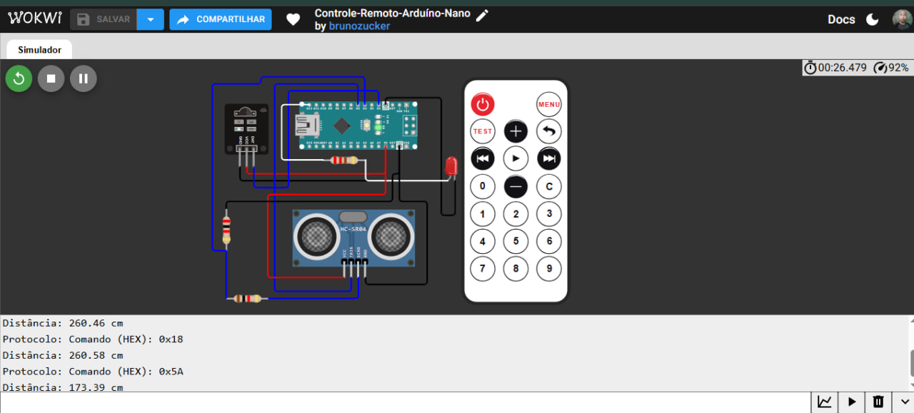

# 📡 Controle-Remoto-Arduino-Nano

Simulação de um sistema com controle remoto infravermelho e sensor ultrassônico, feita com Arduino Nano no Wokwi.

---

## 📋 Sobre o projeto

A ideia foi juntar duas leituras diferentes no mesmo circuito: receber comandos de um controle remoto infravermelho e medir a distância de um objeto com um sensor ultrassônico. Cada vez que o Arduino recebe um comando do controle, ele mostra o código da tecla no Monitor Serial, pisca um LED e faz uma medição de distância.

O projeto foi feito como parte do meu portfólio prático de sistemas embarcados, usando o Wokwi como ambiente de simulação.

▶️ [Abrir a simulação no Wokwi](https://wokwi.com/projects/476248201982087169)

---

## 🛠 Ferramentas utilizadas

- Wokwi (simulador)
- Arduino Nano
- Receptor infravermelho (IR)
- Controle remoto IR
- Sensor ultrassônico HC-SR04
- 1 LED vermelho
- Resistores: 220 Ω (LED), 1 kΩ e 2 kΩ (divisor de tensão do ECHO)
- Linguagem C++ (Arduino)
- Biblioteca IRremote

---

## 🏗 O que foi montado

O circuito tem três blocos:

- **Receptor IR:** alimentado com 5 V e GND, com o sinal de dados ligado ao pino 2 do Nano.
- **LED de aviso:** ligado ao pino 12 com um resistor de 220 Ω em série. Ele pisca sempre que um comando é recebido.
- **Sensor ultrassônico HC-SR04:** alimentado com 5 V e GND, com o TRIG no pino 5. O ECHO passa por um divisor de tensão feito com um resistor de 1 kΩ e um de 2 kΩ, e o ponto central vai para o pino 4.

O divisor de tensão reduz o sinal de 5 V do ECHO para cerca de 3,3 V antes de chegar ao Arduino. Com o Nano, que trabalha em 5 V, ele não é obrigatório, mas é uma boa prática e deixa o circuito pronto para placas de 3,3 V.

### Pinagem

| Componente | Pino do Arduino Nano |
|---|---|
| Receptor IR (DAT) | 2 |
| ECHO do HC-SR04 (após divisor) | 4 |
| TRIG do HC-SR04 | 5 |
| LED vermelho | 12 |

---

## 🔧 Como funciona

1. O Arduino fica aguardando um sinal do receptor infravermelho.
2. Quando uma tecla do controle é pressionada, o código lê o comando e mostra o valor em hexadecimal no Monitor Serial.
3. O LED pisca por 50 ms para indicar que o comando foi recebido.
4. O código envia um pulso de 10 µs no TRIG do sensor ultrassônico.
5. O tempo de retorno no ECHO é medido com `pulseIn()` e convertido em centímetros.
6. A distância é mostrada no Monitor Serial e o receptor fica pronto para o próximo comando.

O cálculo da distância usa a velocidade do som (0,0343 cm/µs) dividida por dois, já que o som vai até o objeto e volta:

```
distância = duração × 0,0343 / 2
```

---

## 💻 Código

```cpp
// Controle-Remoto-Arduíno-Nano

#include <IRremote.h>

// Pino Digital 12 onde está o LED
#define PINO_LED 12

// Pino Digital 2 onde está o receptor IR
#define PINO_RECV 2

// Pino Digital 4 onde está o ECHO do sensor ultrassônico
#define PINO_ECHO 4

// Pino Digital 5 onde está o TRIG do sensor ultrassônico
#define PINO_TRIG 5

void setup() {
  Serial.begin(9600);

  // Inicializa o receptor IR no pino especificado
  IrReceiver.begin(PINO_RECV, ENABLE_LED_FEEDBACK);
  Serial.println("Receptor IR pronto. Aguardando comandos do controle...");

  // Define o pino do LED como saída
  pinMode(PINO_LED, OUTPUT);

  // Define o pino TRIG como saída
  pinMode(PINO_TRIG, OUTPUT);

  // Define o pino ECHO como entrada
  pinMode(PINO_ECHO, INPUT);
 
}

void loop() {
  if (IrReceiver.decode()) {

    // Verifica o protocolo detectado
    if (IrReceiver.decodedIRData.protocol) {
      Serial.print("Protocolo: ");
      Serial.print("Comando (HEX): 0x");
      Serial.println(IrReceiver.decodedIRData.command, HEX);
    } else {

      // Exibe outros protocolos caso o controle genérico do Wokwi envie algo diferente
      Serial.print("Outro protocolo - HEX: 0x");
      Serial.println(IrReceiver.decodedIRData.command, HEX);
    }
   
    // Pisca o LED para indicar recepção
    digitalWrite(PINO_LED, HIGH);
    delay(50);
    digitalWrite(PINO_LED, LOW);

    // Garante que o pino TRIG esteja inicialmente em nível baixo
    digitalWrite(PINO_TRIG, LOW);
    delayMicroseconds(10);

    // Envia o pulso de disparo para o sensor ultrassônico
    digitalWrite(PINO_TRIG, HIGH);
    delayMicroseconds(10);
    digitalWrite(PINO_TRIG, LOW);

    // Mede o tempo de retorno do sinal ultrassônico
    long duracao = pulseIn(PINO_ECHO, HIGH);

    // Calcula a distância em centímetros
    float distancia = duracao * 0.0343 / 2;

    // Exibe o valor da distância no Monitor Serial
    Serial.print("Distância: ");

    // Exibe o valor calculado da distância
    Serial.print(distancia);

    // Exibe a unidade de medida em centímetros
    Serial.println(" cm");

    // Prepara o receptor para receber o próximo sinal
    IrReceiver.resume();
  }
}
```

---

## 📸 Evidências do funcionamento

### Circuito montado e Monitor Serial
A imagem mostra o Arduino Nano, o receptor IR, o controle remoto, o sensor HC-SR04, o LED e os resistores. Na parte de baixo, o Monitor Serial exibe os comandos recebidos (como 0x18 e 0x5A) e a distância medida em cada leitura.



---

## 📁 Arquivo do diagrama

O arquivo `diagram.json` com todas as peças e conexões está disponível no repositório e pode ser importado direto no Wokwi. Lembre de adicionar a biblioteca **IRremote** no projeto.

[📥 Download — diagram.json](diagram.json)

---

## 💡 O que aprendi com esse projeto

O principal foi entender como o receptor infravermelho funciona com a biblioteca IRremote: o Arduino decodifica o sinal e entrega o comando da tecla em hexadecimal, o que permite associar cada botão a uma ação.

Também aprendi como o HC-SR04 mede distância. O TRIG dispara o pulso, o ECHO devolve um sinal com a duração do trajeto do som, e a conta com a velocidade do som transforma esse tempo em centímetros.

Outro ponto foi o divisor de tensão no ECHO, que mostrou como dois resistores simples reduzem o nível de um sinal antes de ele chegar ao microcontrolador.

---

## ⚠️ Sobre o projeto

Essa simulação é uma base para estudo. A medição de distância acontece só quando um comando do controle é recebido, e o código ainda não associa cada tecla a uma ação diferente. Uma evolução natural seria fazer cada botão acionar uma função, como ligar o LED ou disparar um alerta quando algo estiver perto demais.

---

## 🚀 Próximos projetos

Outros projetos de sistemas embarcados serão postados em breve, com níveis de complexidade maiores.

---

## 👤 Autor: Bruno Zucker
